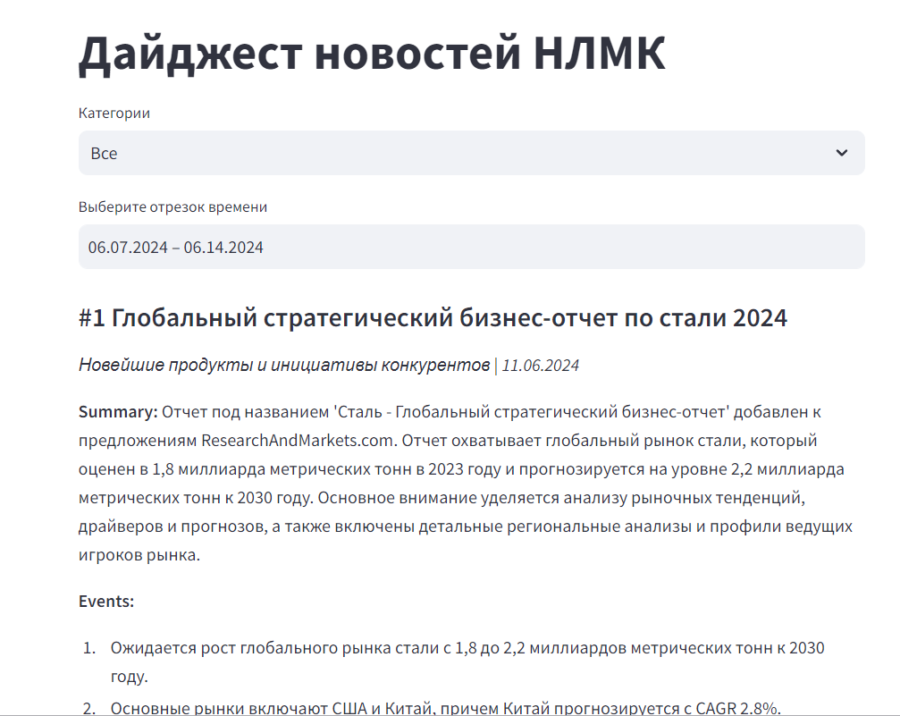

# NLMK Hack

Это приложение автоматизирует процесс поиска, сбора, и анализа новостей для создания новостного дайджеста. Оно работает в несколько этапов:

1. **Поиск новостей:** Использует запросы для поиска актуальных новостей через Google Search API и News API.
   
2. **Извлечение текста:** С помощью специальных инструментов, приложение загружает веб-страницы, извлекает из них чистый текст.

3. **Анализ текста:** Используя модель GPT-4o, приложение анализирует тексты, присваивает им оценку релевантности от 0 до 10, и генерирует краткие изложения и ключевые моменты. Также оно классифицирует тексты по типу (например, новости или блоги).

4. **Удобный интерфейс:** В конечном интерфейсе, новости ранжируются по их релевантности. Пользователи могут фильтровать новости по категориям и датам публикации.




---

Оверью по коду и детали реализации.


1. Запросы для поиска новостей: [search_queries_merged.json](queries/search_queries_merged.json)


2. Код для поиска в новостей. На этом этапе мы ищем и собираем url страниц с актуальными и релевантными новостями, сами страницы парсятся на следующем шаге.
 - Google Search API: [search.ipynb](search.ipynb)
 - News API: [search-newsapi.ipynb](search-newsapi.ipynb)


3. Web Scraper. Здесь мы открываем url и скачиванием raw html. Затем мы переводим сырой HTML в очищенный текст для подачи в LLM на анализ.
 - Для загрузки используем AsyncChromiumLoader и AsyncHtmlLoader из Langchaing [extract_texts.py](extract_texts.py)
 - Для очистки - BeautifulSoup и html2text (оба инструмента также реализованы в Langchaing) [extract_texts.py](extract_texts.py)


4. Просим LLM проставить relevance score для каждой новости от 0 до 10. Это полезно по двум причинам: 1) выдача гугла часто выдает совершенно нерелевантные новости, которые нужно убрать; 2) по relevance score будем ранжировать итоговый дайджест, отправляя самые релевантные новсти в топ. Помимо скора, LLM генерирует summary, key_events, title, text_type (является ли текст новостю, блог постом, или чем-то еще?)
 - Мы используем модель `GPT-4o`.
 - code: [chatgpt.ipynb](chatgpt.ipynb)
 - Полный промпт: [prompts/ru.md](prompts/ru.md)

JSON выглядит так:
```
{
  "summary": "Предоставьте краткое содержание текста, выделив его основные моменты",
  "key_events": "Кратко перечислите ключевые события, описанные в новостном тексте",
  "title": "Дайте тексту название на русском языке",
  "relevance_score": "Присвойте оценку от 0 до 10, основываясь на релевантности текста для стальной промышленности",
  "text_type": "Классифицируйте текст как один из следующих типов: [news, blog_post, forum, review, educational]"
}
```


5. Объединяем всё в удобный интерфейс, сделанном на Streamlit. Новости ранжируются по relevance_score, их можно фильтровать по категориям и по дате публикации.
 - [app.py](app.py)

